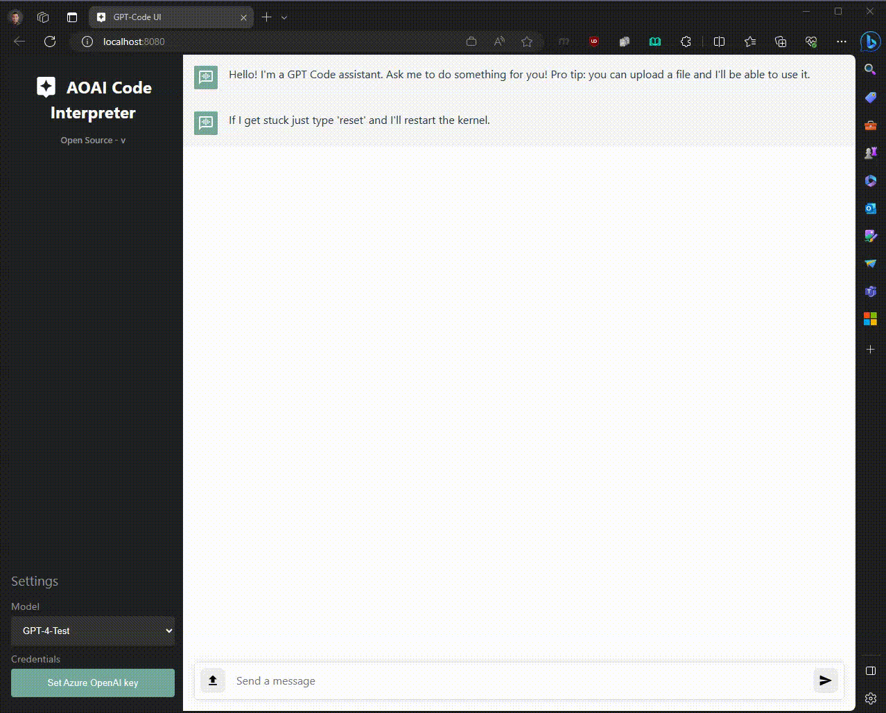

# AOAI Code Interpreter

An open source implementation of OpenAI's ChatGPT [Code interpreter](https://openai.com/blog/chatgpt-plugins#code-interpreter).

Simply ask the OpenAI model to do something and it will generate & execute the code for you.

## Installation for Local Test/Dev

Open a terminal and run:

```sh
python3 -m venv venv
source ./venv/bin/activate
pip install -r requirements.txt
pip install -e .
gptcode
```

## User interface

 
## Features
- File upload
- File download
- Context awareness (it can refer to your previous messages)
- Generate code
- Run code (Python kernel)
- Model switching (GPT-3.5 and GPT-4)

## Misc.
### Using .env for Azure OpenAI key
You can put a .env in the working directory to load the `OPENAI_API_KEY` environment variable.

### Configurables
Set the `API_PORT`, `WEB_PORT`, `SNAKEMQ_PORT` variables to override the defaults.

Set the `MAX_TOKEN_LIMIT` to one that is compatible with the models you will be using. For instance, if you are using GPT-4-32k, you can increase the token limit from the default of 430,000 to slighly less than 32,000.


Set `OPENAI_BASE_URL` to change the Azure OpenAI API endpoint that's being used (note this environment variable includes the protocol `https://...`).

You can use the `.env.azure-example` in the repository (make sure you `git clone` the repo to get the file first).

```
cp .env.azure-example .env
vim .env
gptcode
```

## Original Code Credit
The original code base this repo is built on is from [Rick Lamers](https://github.com/ricklamers). Here is the repository this repo is forked from [GPT-Code UI](https://github.com/ricklamers/gpt-code-ui).